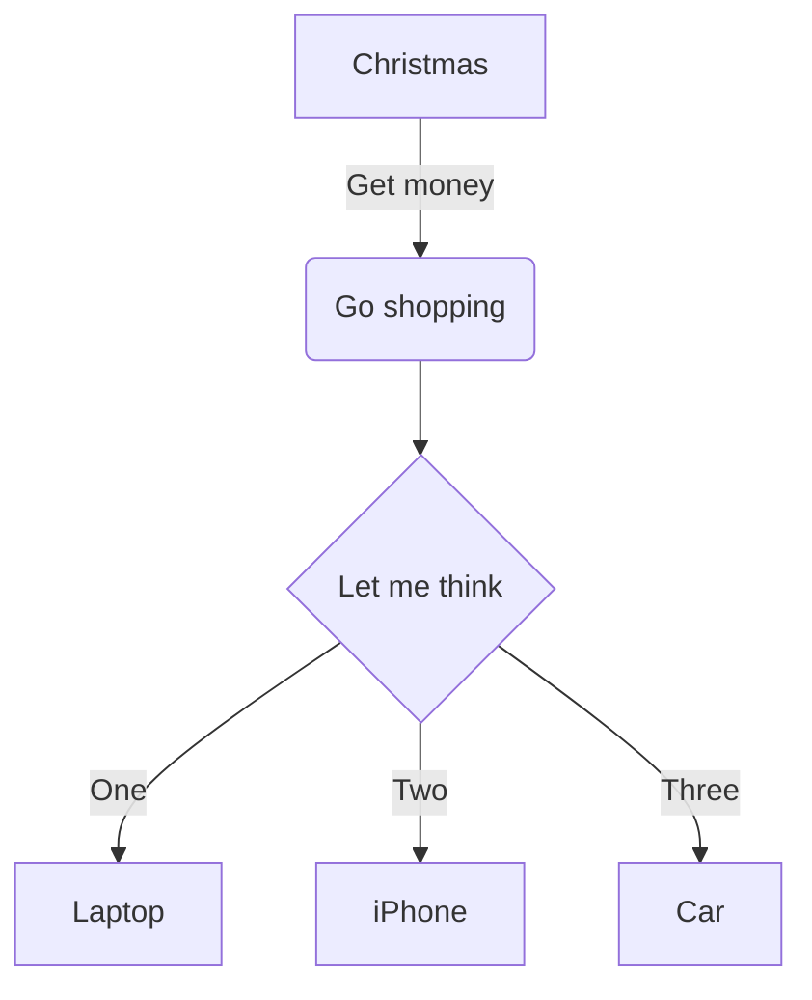
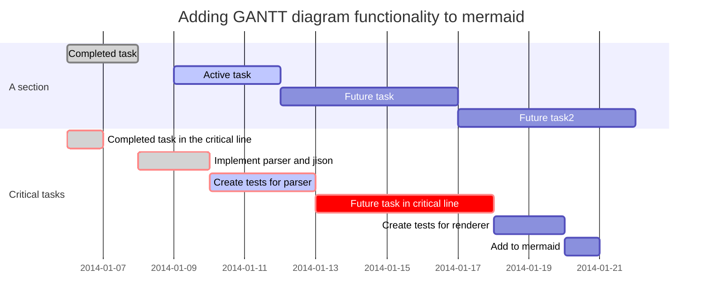

> 注意：本文介绍的语法，开启 <act:预览> 能看到最终的渲染效果。
> 本文包含两部分内容，一部分是《其它常见 Markdown 语法》，另一部分为《Metion 的扩展语法》。

## 其它常见Markdown 语法
### 列表
**无序列表:**
- 每行以 - 开头并留空
- Red & Green

**有序列表:**
1.  数字+小数点，并留空
2.  Little Bird

### 分割线
`-`加上空格组成，并且是三个以上。

- - - - - - -  - - - - - - - - - - - - - - - - - - 

## Metion的扩展语法
### 注释
有些时候，需要在书写过程中留一些**备忘**性质的文本，但是不希望最终结果中可见的，可以使用**注释**语法，一般情况下是用不到的。
// 我是一行注释，但最终会出现在最终的 HTML 源码中。
/// 多了一个/，也是注释，但最终内容不会出现在 HTML 源码中。

### TOC
单独一行输入 [TOC]，效果如下:
[TOC]

### 高度占位
单独一行，输入 **[整数]** (也可以是负整数)可以产生一个**高度占位** (单位为 px)。
[100]
上面这一行，就代表了 100px (像素) 的高度。

**注意:** 高度占位本身会占据**一行**的高度，如果需要一个很小的高度，需要使用 `[负整数]` 的形式进行调整。

### 冒号的约定
如果一个单独行的末尾以冒号结尾，在 Metion 的默认 CSS 样式中，会默认减少间距以让视觉上与下文内容产生联系。

比如说：
- 上面这行文本，它是单独一行
- 后面则是列表的语法
- 在预览中，两者在视觉上产生了关联性
- 你可以试试去掉冒号，看预览的效果
- 如果冒号后多一个空格，这个规则会失效

### 行内文本的修饰 #inline_style
比如下面这个"你好"的效果 `red:你好` ，它实际的文本为:
```
`red: 你好`
```
如果只是需要对文字修饰颜色，而不是其背景色，可以在颜色颜色前面增加 @，比如 `@red:你好` ，它实际的文本为:
```
`@red: 你好`
```

像 `颜色关键字: 文字` 的语法，可以产生对行内文本的修饰，如果在文章的头部声明对应的 `style_颜色关键字`，并指明具体的 CSS样式，则它的优先级最高。
比如本文的头部声明了：
```
style_green: "color: blue"
```
那么下面这段文字:
`green:看起来是绿色的，实际上渲染后是蓝色的`  

### 整行样式修饰
一行文本末尾添加(英文)**中括号**，可以进行简单的样式修饰: [right]
也可以是多个关键词一起，比如: [center red 16px]
如果**行尾多一个空格**，这个规则也会失效。

**修饰的关键词有如下类型:**
- center (或 middle)、left、right，表示居中、居左、居右
- 如果是 + 或者 - 开头的，表示行首的缩进，比如 `+2` 或者`-2`
- n% 表示缩放， `200%` 表示放大到 2 倍
- 小数点 (如x.y)  表示行高 [5.5]
- 整数 表示字体大小 [15]
- 颜色值 (如 blue #333) 表示字体色 [blue]
- @颜色值 (如 @red @#888888) 表示背景色 [white @red]
- 除以上规则之外，如果有一个不能匹配的关键词，则认为是字体 [red 娃娃体]


### PDF 的强制分页
如果单独一行 [PAGE] 表示导出 PDF 时强制分页，其它时候不会有实际内容产生。

### 关联文档
如果单独一行 [Related] 表示显示与当前文档关联的其它文档列表，提取的规则会根据当前文档的 Tag、双向链接、目录关系等属性随机提取，也可能为空。

### 脚注
《远和近》这首诗的作者是顾城[^gucheng]。
其中`[^gucheng]`就是脚注的声明，你可以在文末对这个关键标注进行说明。

[^gucheng]: 这里是说明的开始，顾城，童话诗人，以及坏掉了的人。


### Mermaid 绘图
Metion 支持 [mermaid](https://github.com/knsv/mermaid) 的语法，更具体的请访问 mermaid 的项目主页，此处仅作 Demo 呈现，我们所知也并不太多。



下面的是 mermaid 支持的甘特图语法:


### 其它
另外，Metion 针对表格的语法有比较多的强化，是基于**代码块**语法的扩充，具体请参考:  [[ 代码、表格、数学公式 ]] 。
