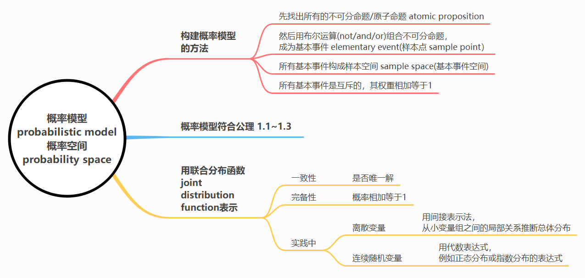

# 概率、图和因果模型导论

```
机会是思想之母，
也是思想的掘墓人。
                -- 帕斯卡（1670）
```

## 1.1 概率论导论

### 1.1.1 为什么是概率？

因果性意味着定律般的必然性，然而概率意味着例外、怀疑和缺乏规律。尽管如此，还是有2个令人信服的理由让我们，实际上是迫使我们，从概率分析入手研究因果关系。其中一个非常简单，另外一个更加微妙。

最简单的原因在于我们观察到因果论调经常被用于不确定的情况。比如，我们说“鲁莽驾驶导致交通事故”或者“你的懒惰使你挂科”（Suppes 1970），我们心里清楚前项只是倾向于使结果更有可能发生，而不保证一定会发生。因此，任何旨在涵盖这种论调的因果关系理论都必须用一种能区分不同可能性程度的语言来描述，即概率语言。基于这种观察，我们注意到概率论是目前大多数使用因果模型的学科的官方数学语言，包括经济学、流行病学、社会学和心理学。在这些学科中，研究人员不仅关注因果连系是否存在，还关注这些连系之间的相对强度以及从干扰中推断出这些连系的方法。在统计分析方法的帮助下，概率论提供了应对这些观察并从中得出推论的原则和方法。

更加微妙的原因在于即便是自然语言中最坚定的因果表达也存在例外，并且这些例外如果按照确定性逻辑的标准规则进行处理可能会造成巨大困难。例如，看下面2条貌似合理的前提：

1. 每次我的房顶湿了，我邻居的房顶也会湿。
2. 如果我用水管冲洗房顶，房顶会湿。

从字面意义上，这两个前提蕴含了难以执行的结论：每次我用水管冲房顶，我邻居的房顶也会湿。

这种矛盾的结论通常归因于我们语言有限的粒度，正如前提1中隐含了很多例外所表现的那样。其实，只要我们不嫌麻烦将这些例外解释并记录下来矛盾就消失了。例如：

1. 每次我的房顶湿了，我邻居的房顶也会湿，除了房顶用塑料布盖上或我用水管冲洗了房顶等情况。

概率论的优点是特别能容忍未经解释的例外，这让我们能关注因果关系的主要问题而无需处理此类矛盾。

我们在后面的章节会看到，容忍例外只能解决与因果相关的部分问题。剩下的问题--包括推理、干预、识别、分支、混淆、反事实以及解释等问题--才是本书的主题。通过用概率语言描述这些问题，我们强调这些问题在不同语言中的普遍性。第7章将用确定逻辑语言重新描述这些问题并引入概率来描述未观测到事实的不确定性。

### 1.1.2 概率论中的基本概念

本书的大部分讨论将聚焦在具有有限个离散变量的系统上，因此只需要概率论中的基本符号和基础概念。扩展到连续变量只会概述不会详述。想要了解更多数学机制的读者可以参考很多这个学科优秀的教科书--比如，Feller (1950), Hoel et al. (1971)等，或者Suppes (1970)的附录。本节简要总结了基本的概率概念，主要基于Pearl (1988b)，同时特别强调贝叶斯推理及其在不确定性下与人类心理的联系。标准教科书通常缺少这种强调。

<div class="alert alert-warning" role="alert">
    <p><center>贝叶斯的概率是信念度 <i>degree of belief</i></center></p>
    <p><center>非贝叶斯的概率是频率 <i>frequency</i></center></p>
    <br>
    <p><center>传统概率用联合概率P(A,B)去定义条件概率P(A|B)</center></p>
	<p><center>用等号右边定义等号左边，即等号右边是更基础的</center></p>
	<p>$$P(A|B)=\frac {P(A,B)}{P(B)}$$</p>
	<br>
    <p><center>贝叶斯概率认为条件概率比联合概率更基础，因此用条件概率（右）去计算联合概率（左）</center></p>
	<p>$$P(A,B)=P(A|B)P(B)$$</p>
</div>



* 有4个小组，每个小组10人，由每组选出一人组成一个课外活动小组，共有多少不同的？
  *10X10X10X10=10000
  有4个小组，每个小组10人，由每组选出一人组成一个课外活动小组，共有10000种不同的选法。*
* 有三组数每组都是从0到9，每组选一个数字出来，共有多少种选法？
  *10^3=1000种。*
* 每组四个数字，一共九组，从这些数字里从每组选一个数字，组合成九个数字一组的，有多少种可能? 
  *每组有4种选法，9组，共4^9种选法。*

***==> 每组n个，一共m组，即：不可分命题（n乘m）个；基本事件（n的m次方）个***

