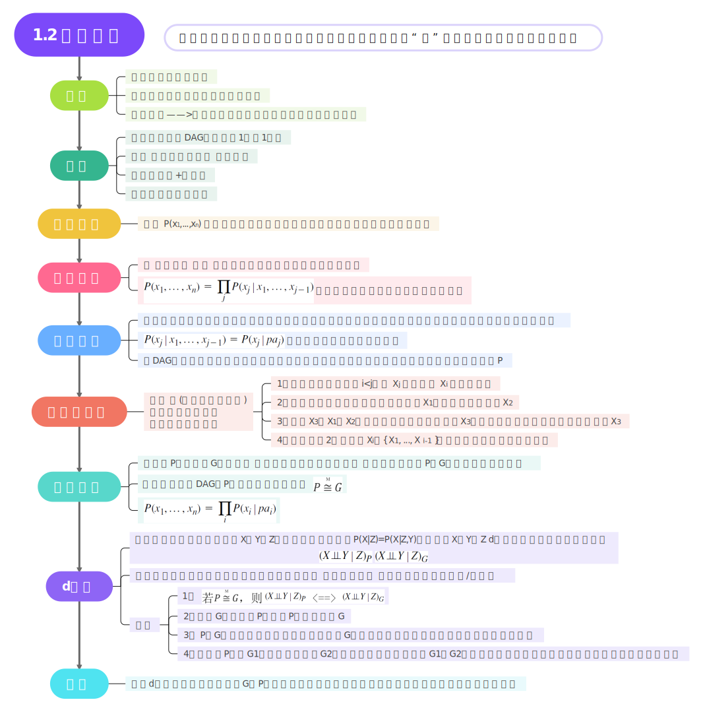
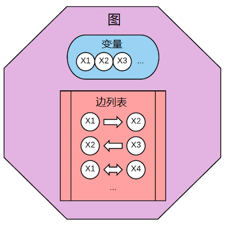
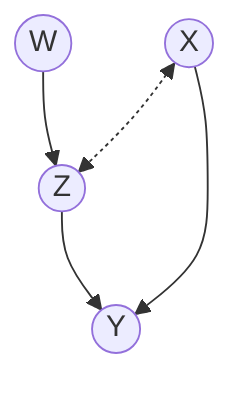
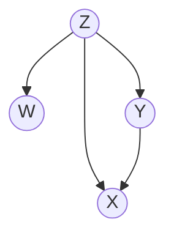

## 1.2 图与概率

### 关于explaining away

* explaining away指的是：如果一个问题可以被多个原因影响，那么如果确定了这些原因中的某一个确定存在，则其他原因可能会导致该问题的概率会下降。我们称这一个确定存在的原因explain away其他潜在得可能原因。

* 例：对于一个具有多个嫌疑人的案件，如果不存在共犯可能的情况下，各个嫌疑人作案的事件是相互独立的，我们现在已经有足够证据证明其中某个嫌疑人作案了，那么自然而然也就同时说明其他嫌疑人作案的概率变小了。
* $\mathit{A \rarr C \larr B}$中，$\mathit{A {\perp\!\!\!\perp} B}$ if C is unobserved, but $\mathit{A {\cancel{\perp\!\!\!\perp}} B}$ if C is observed.

### 关于Figure 1.3

* 图1.3a中，在Z1、Z2、Z3都未知的情况下，X、Y之间的两条路径都是被阻断的；
  （即：对撞接合的两端变量在对撞点变量未知时都是阻断的）
  当Z1是已知的，则路径 $\mathit{X \rarr Z_1 \harr Z_3 \larr Y}$不再是阻断的，反而被连通了；
  因为Z1连通了Z1和Z3这两个对撞接合：原因之一是Z1是对撞接合中已知的对撞点，
  原因之二是在路径$\mathit{Z_3 \rarr Z_2 \rarr Z_1}$中可见Z1是对撞点Z3的后代。 
  
* 图1.3b中，X和Y不能被任何节点的集合 d分离，包括空集。
  ** 注：被空集（节点集/变量集）d分离是什么情况？
  例如 $\mathit{A \rarr B \larr C}$，当Z为空集时，B不属于Z，此时A、C就是被Z  d分离的（参考page17中间 $\mathit{X_2 \rarr X_4 \larr X_3）}$*
  
  * 如果已知Z2，则阻断了路径$\mathit{Y \rarr Z_2 \rarr Z_1 \rarr X}$，但同时连通了路径$\mathit{X \rarr Z_2 \larr Y}$；
  * 如果已知Z1，同样阻断了路径$\mathit{Y \rarr Z_2 \rarr Z_1 \rarr X}$，但同时也连通了路径$\mathit{X \rarr Z_2 \larr Y}$，因为Z1是对撞点Z2的后代。
  
  

### 关于Observational Equivalence

* 仅从概率难以推断方向性。若仅看概率，而不进行控制实验或加入时间信息，是无法区分观测等价的两个网络的。
  在图1.2中，调转X1、X2之间的箭头，并不会创造v结构或毁掉v结构，因此两者是观测等价的网络。
  从概率信息中，并无法确定X1、X2之间的方向。
  但$\mathit{X_2 \rarr X_4}$和$\mathit{X_4 \rarr X_5}$，若调转箭头则会创造新的v结构。
  
  ** 有些概率在没有时间信息的情况下，也可以做到约束图中的某些箭头方向。*

### 1.2.1 图符号和术语

图由 *顶点* (或*节点*）集合 $\mathit{V}$ 和连接一对节点的边集合 $\mathit{E}$ 组成。图中的节点代表变量（其中有共同的符号$\mathit{V}$)，边表示变量对之间的特定关系，不同应用场景对边的解释会大相径庭。被边连接的两个变量被称为 *相邻*。

 

图中的每一条边要么是有向的（边的一段有箭头）要么是无向的（没有标注箭头）。在某些应用场景下也会用“双向”边表示存在未被观察的共同原因（也叫*混杂因子*）。这种边会被画成两端有箭头的虚线（见图1.1(a)）。如果所有边都是有向的（见图1.1(b)），我们就得到一个*有向*图。如果我们移除图 $\mathit{G}$ 中所有边上的箭头，得到的无向图被称为图 $\mathit{G}$ 的*骨架*。图中的*路径*是首尾相接的边的序列（例如图1.1(a)中 $\mathit{((W, Z), (Z, Y), (Y, X), (X, Z)) }$）。换句话说路径是图中任意沿着边不间断不交叉的通路，既可以沿着箭头前进，也可以逆着箭头前进。如果路径中的每一条边都是从一个顶点箭头指向另一个顶点的边，我们称之为 *有向路径*。例如1.1(a)中，路径  $\mathit{((W, Z), (Z, Y))} $是有向的，而路径$\mathit{ ((W, Z), (Z, Y), (Y, X))}$ 和 $\mathit{((W, Z), (Z, X)) }$则不是。如果图中两个顶点之间存在路径，则称这两个顶点是*连通的*，否则则称这两个顶点*不连通*。

图1.1(a) 包含有向边和双向边的图

图1.1(b) 与(a)拥有相同骨架的有向无环图(DAG)

有向图可能包含有向环（例如$\mathit{X \rarr Y, Y \rarr X}$），表示互为因果或反馈过程，但不是自回路（例如$\mathit{X \rarr X}$）。一个图（例如图1.1中的2个图）不包含有向环被称为*无环*。一个图如果即有向又无环（图1.1(b)）被称为*有向无环图*（DAG）。本书关于因果关系的讨论主要围绕有向无环图。我们采用亲属关系名词（例如父母、孩子、后代、祖先、配偶）表示图中多种关系。这些亲属关系沿着图中完整箭头定义，包括形成有向环的箭头但不包括双向和无向边。例如图1.1(a)中，$\mathit{Y}$ 有2个父亲（$\mathit{X}$ 和 $\mathit{Z}$），3个祖先（$\mathit{X}$ 、 $\mathit{Z}$ 和 $\mathit{W}$），没有孩子。而$\mathit{X}$ 没有父母（因此也就没有祖先），一个配偶（$\mathit{Z}$），一个孩子（$\mathit{Y}$）。图中一个*家族* 指一个节点及其父节点的集合。例如$\mathit{\{W\}, \{Z, W\}, \{X\}, \{Y, Z, X\}}$ 是图1.1(a)中的家族。

有向图中，如果节点没有父母则称为*根节点*，如果没有孩子则称为*叶子节点*。每个DAG至少拥有一个根节点和一个叶子节点。连通DAG中每个节点最多只有一个父母则称为*树*，如果树中每个节点最多只有一个孩子则称为*链*。图中节点两两之间都有边连接则称为*完全图*。例如图1.1(a)是连通的但不是完全的，因为$\mathit{(W, X)}$ 和 $\mathit{(W, Y)}$ 没有相邻。 

  <h4 class="alert-heading">总结:</h4>
<table class="table table-bordered">
  <thead>
    <tr>
      <th>术语</th>
      <th>解释</th>
    </tr>
  </thead>
  <tbody>
  	<tr>
      <td>顶点(vertix) 或 节点(node)</td>
      <td>图中的顶点代表变量</td>
    </tr>
    <tr>
      <td>边(edge)</td>
      <td>图中的边代表两个变量之间的关系</td>
    </tr>
    <tr>
      <td>相邻(adjacent)</td>
      <td>两个顶点被边连接，则称两个顶点相邻</td>
    </tr>
    <tr>
      <td>有向图(directed graph)</td>
      <td>图中所有的边都是有向的</td>
    </tr>
    <tr>
      <td>骨架(skeleton)</td>
      <td>去掉图中边的方向即得到图的骨架</td>
    </tr>
    <tr>
      <td>路径(path)</td>
      <td>首尾相接的边的序列</td>
    </tr>
    <tr>
      <td>有向路径(directed path)</td>
      <td>路径中所有边都是有向的</td>
    </tr>
    <tr>
      <td>连通(connected)</td>
      <td>如果两个顶点之间存在路径，则成这两个顶点连通</td>
    </tr>
    <tr>
      <td>无环(acyclic)</td>
      <td>图中不存在有向环</td>
    </tr>
    <tr>
      <td>有向无环图(directed acyclic graph, DAG)</td>
      <td>一个图即连通又无环</td>
    </tr>
    <tr>
      <td>家族(family)</td>
      <td>顶点及其父母组成的顶点集合</td>
    </tr>
    <tr>
      <td>根节点(root)</td>
      <td>没有父母的节点</td>
    </tr>
    <tr>
      <td>叶子节点(sink)</td>
      <td>没有孩子的节点</td>
    </tr>
    <tr>
      <td>树(tree)</td>
      <td>每个顶点最多只有一个父母的连通图称为树</td>
    </tr>
    <tr>
      <td>链(chain)</td>
      <td>每个顶点最多只有一个孩子的树称为链</td>
    </tr>
    <tr>
      <td>完全图(complete graph)</td>
      <td>图中两两节点之间都有边连通的图</td>
    </tr>
  </tbody>
</table>

### 1.2.2 贝叶斯网络

