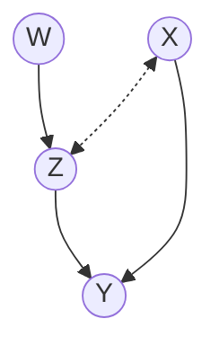
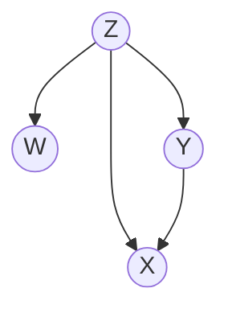

## 1.2 图与概率

### 1.2.1 图符号和术语

图由 *顶点* (或*节点*）集合 $\mathit{V}$ 和连接一对节点的边集合 $\mathit{E}$ 组成。图中的节点代表变量（其中有共同的符号$\mathit{V}$)，边表示变量对之间的特定关系，不同应用场景对边的解释会大相径庭。被边连接的两个变量被称为 *相邻*。

 

图中的每一条边要么是有向的（边的一段有箭头）要么是无向的（没有标注箭头）。在某些应用场景下也会用“双向”边表示存在未被观察的共同原因（也叫*混杂因子*）。这种边会被画成两端有箭头的虚线（见图1.1(a)）。如果所有边都是有向的（见图1.1(b)），我们就得到一个*有向*图。如果我们移除图 $\mathit{G}$ 中所有边上的箭头，得到的无向图被称为图 $\mathit{G}$ 的*骨架*。图中的*路径*是首尾相接的边的序列（例如图1.1(a)中 $\mathit{((W, Z), (Z, Y), (Y, X), (X, Z)) }$）。换句话说路径是图中任意沿着边不间断不交叉的通路，既可以沿着箭头前进，也可以逆着箭头前进。如果路径中的每一条边都是从一个顶点箭头指向另一个顶点的边，我们称之为 *有向路径*。例如1.1(a)中，路径  $\mathit{((W, Z), (Z, Y))} $是有向的，而路径$\mathit{ ((W, Z), (Z, Y), (Y, X))}$ 和 $\mathit{((W, Z), (Z, X)) }$则不是。如果图中两个顶点之间存在路径，则称这两个顶点是*连通的*，否则则称这两个顶点*不连通*。

图1.1(a) 包含有向边和双向边的图

图1.1(b) 与(a)拥有相同骨架的有向无环图(DAG)

有向图可能包含有向环（例如$\mathit{X \rarr Y, Y \rarr X}$），表示互为因果或反馈过程，但不是自回路（例如$\mathit{X \rarr X}$）。一个图（例如图1.1中的2个图）不包含有向环被称为*无环*。一个图如果即有向又无环（图1.1(b)）被称为*有向无环图*（DAG）。本书关于因果关系的讨论主要围绕有向无环图。我们采用亲属关系名词（例如父母、孩子、后代、祖先、配偶）表示图中多种关系。这些亲属关系沿着图中完整箭头定义，包括形成有向环的箭头但不包括双向和无向边。例如图1.1(a)中，$\mathit{Y}$ 有2个父亲（$\mathit{X}$ 和 $\mathit{Z}$），3个祖先（$\mathit{X}$ 、 $\mathit{Z}$ 和 $\mathit{W}$），没有孩子。而$\mathit{X}$ 没有父母（因此也就没有祖先），一个配偶（$\mathit{Z}$），一个孩子（$\mathit{Y}$）。图中一个*家族* 指一个节点及其父节点的集合。例如$\mathit{\{W\}, \{Z, W\}, \{X\}, \{Y, Z, X\}}$ 是图1.1(a)中的家族。

有向图中，如果节点没有父母则称为*根节点*，如果没有孩子则称为*叶子节点*。每个DAG至少拥有一个根节点和一个叶子节点。连通DAG中每个节点最多只有一个父母则称为*树*，如果树中每个节点最多只有一个孩子则称为*链*。图中节点两两之间都有边连接则称为*完全图*。例如图1.1(a)是连通的但不是完全的，因为$\mathit{(W, X)}$ 和 $\mathit{(W, Y)}$ 没有相邻。 

