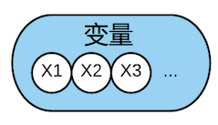
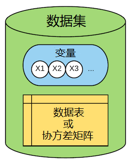
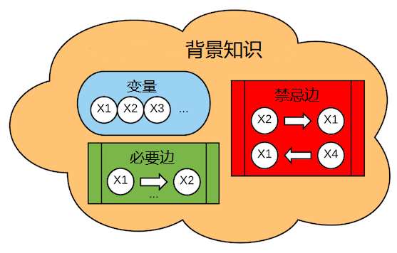
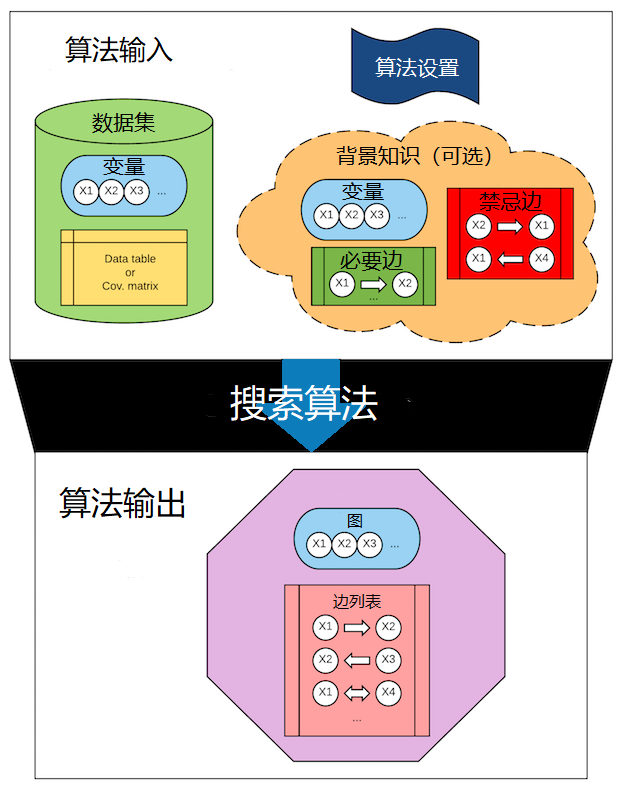
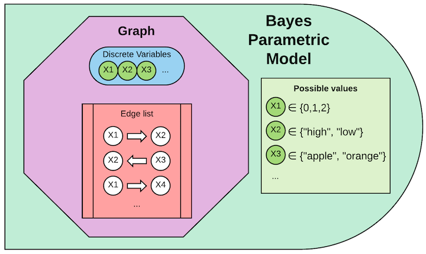
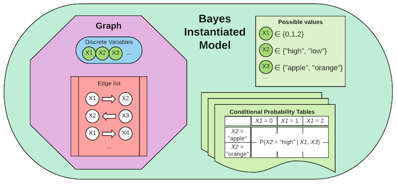
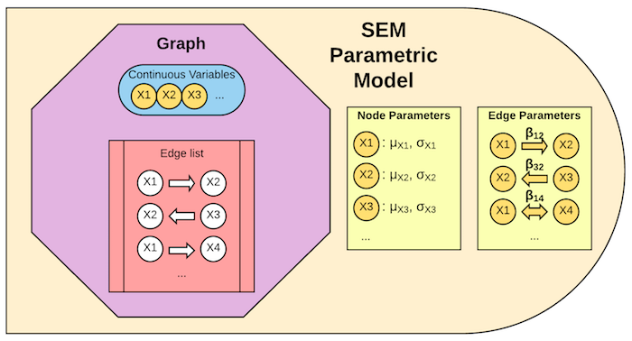
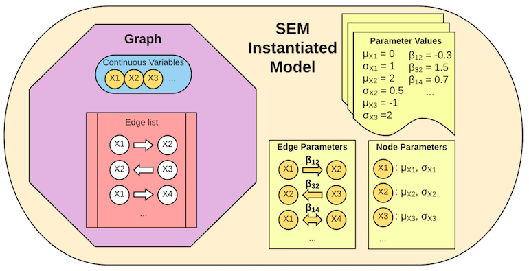

# 重要概念

## 变量 = 节点 = 顶点

因果推断是个科学发现问题，所以随机变量是最基本的概念。在因果图中，变量以**节点**或**顶点**的形式存在。

在其他图工具中，一般是先构建图，然后再填入节点。如果图不存在了节点也随之消失。与这些图工具不同，我们将节点视为基本对象。
你可以用同一组节点构建多个图。这与我们处理科学问题的思路一致：先知晓变量，然后从中获得因果关系。

变量可以是**离散值**也可以是**连续值**，不同数值类型对应不同的搜索算法。

当导入数据时变量会自动创建，或者手动创建图时手动创建变量。

## 数据集

数据集分为2部分：第一部分是变量集合 $V$，第二部分是这些变量的观测值集合 $X$ 或这些变量的协方差矩阵 $\Sigma$。

数据集在导入数据时创建。

## 图

图 $G$ 由节点集合 $V$ 和边集合 $E$ 组成。每条边有4部分信息：一对节点和一对端点。
例如边 $(A, B, -, >)$ 表示 $A \rarr B$，边 $(B, C, >, >)$ 表示 $B \leftrightarrow C$ 。
这使得图的表示非常灵活：既可以表示无向边，也可以表示双向边，甚至一些特殊边。
边 $A \rarr B$ 也以描述为“A对B存在直接因果效应”。

## 背景知识

在因果发现算法中，往往需要背景知识（先验知识）作为输入辅助搜索。
背景知识由一组变量、禁忌边列表和必要边列表组成。

构建背景知识时你可以将背景知识视为独立内容--这也就是为什么称其为背景知识。
但是背景知识不能脱离输入的变量，只有这样才能建立禁忌边和必要边，也就是“关于什么的知识”。

## 搜索算法

因果发现问题可以简单理解为，首先我们有一组变量，然后在这些变量能组成的 *所有* 图中，找到一个能够正确描述这些变量之间因果关系的图。

到底要搜索多少图呢？

| 变量数 | 有向无环图数 |
| ----- | -----------|
| 1     | 1          |
| 2     | 3          |
| 3     | 25         |
| 4     | 543        |
| 5     | 29281      |
| 6     | 3781503    |
| ...   | ...        |
| 20    | 超过宇宙中原子的数量    |

这就是为什么我们需要一个算法来搜索，而不是人眼来检查。搜索算法会用很多技巧快速找到答案，不会一个一个图去分析。

搜索算法是一个函数，有对应的输入和输出。输入项为：

* 数据集（必选）
* 背景知识
* 算法设置，不同算法设置参数不同

输出为一个图或与数据相容的一组图（也叫图的“等价类”）。图的类型根据算法不同而不同。

## 参数化模型和实例化模型

概率图只能给我们定性信息，它回答变量之间的因果影响，但不会告诉我们定量的因果效应有多大。
他们对图中变量的概率分布施加约束，但不会完全指定概率分布。因此我们需要模型。

因果模型向图中添加这些缺失的信息：模型指定概率分布，如果我们对某些变量施加干预可以得到其概率分布。

模型适用于如下几个不同任务：

1. 给定我们确信的图和数据，我们可以你和模型学习因果效应的大小；
2. 给定我们想要评估的图和数据，我们可以训练并测试模型来衡量图对数据描述的质量；
3. 给定图，我们可以指定模型来生成该图的模拟数据，用于评估搜索搜索算法。

有两类令人混淆的模型，他们的区别整理在下表：

| | 贝叶斯模型（Bayes Model） | 结构方程模型（SEM） |
| --- | --- | --- |
| 参数化模型 | 图（DAG）中的节点是**离散变量**，每个变量有一组可选值 | 图（DAG）中的节点是**连续变量**（均值和方差以初始化但未赋值），外加一系列线性参数（系数已初始化但未赋值）|
| 实例化模型 | 根据图中每个变量的父节点，给每个变量赋予其可能值的概率| 值赋给线性结构方程所有参数（均值、方差和边系数）|

我们区分参数化模型和实例化模型。参数模型只是 *初始化* 对象，这里我们决定用哪种模型（贝叶斯还是结构方程模型）。
然后实例化模型对模型参数赋值。

### 贝叶斯参数化模型和实例化模型

**“贝叶斯模型”** 仅意味着模型适配 *离散数据*。他与贝叶斯推断没有特殊关系。这里用“贝叶斯模型”仅仅是因为处理离散数据的DAG被称为“贝叶斯网络”。

一个贝叶斯参数化模型对象包含一个图、图中每一个变量的可选值。图必须是有向无环图（DAG）。

一个贝叶斯实例化模型对象包含贝叶斯参数化模型的一切，外加一组条件概率表--每张表对应一个节点，基于图中它的父节点。

### 结构方程参数化和实例化模型

**结构方程模型**用于在某种变量间关系假设下拟合连续数据。既可以拟合标准结构方程模型也可以拟合广义结构方程模型。

线性模型意味着变量间的关系可以用线性方程描述。例如，假设我们有图 $\mathit{X \rarr Y \larr Z}$，我们可以将其描述为标准参数化结构方程模型：

$\mathit{X = \epsilon_1}$

$\mathit{Z = \epsilon_2}$

$\mathit{Y = \alpha X + \beta Z + \epsilon_3}$

其中$\epsilon_1, \epsilon_2, \epsilon_3$是满足高斯分布的独立随机变量。

结构方程参数化模型包含一个图，外加需要指定概率分布的所有变量的列表。在上面的例子中，参数是
$\mathit{\alpha, \beta, \mu_{\epsilon1}, \mu_{\epsilon2}, \mu_{\epsilon3}, \sigma_{\epsilon1}, \sigma_{\epsilon2}, \sigma_{\epsilon3}}$。
然而在结构方程参数化模型对象中，这些参数的值是待定的；这些值通过实例化模型指定（见实例化模型）。

如果选择**广义**结构方程参数化模型，你可以指定父子变量间的非线性关系，并且每个变量可以是非高斯分布的。
例如你可以指定某个变量与其父变量满足二次方程关系：$\mathit{Y = \alpha X + \beta X^2 + \epsilon}$。
你可以指定误差项$\epsilon$具有均匀(0, 1)分布。

注意：尽管广义结构方程模型相比标准结构方程给了你更大的自由，同时也需要你做更多的约束。你必须给出分布的参数化形式，否则无法通过数据训练出模型。
目前没有非参数化模型拟合方法。

结构方程实例化模型为所有参数赋值--在上面的例子中，需要给参数$\mathit{\alpha, \beta}$赋值，同时给出误差项$\mathit{\epsilon}$的均值和方差。

